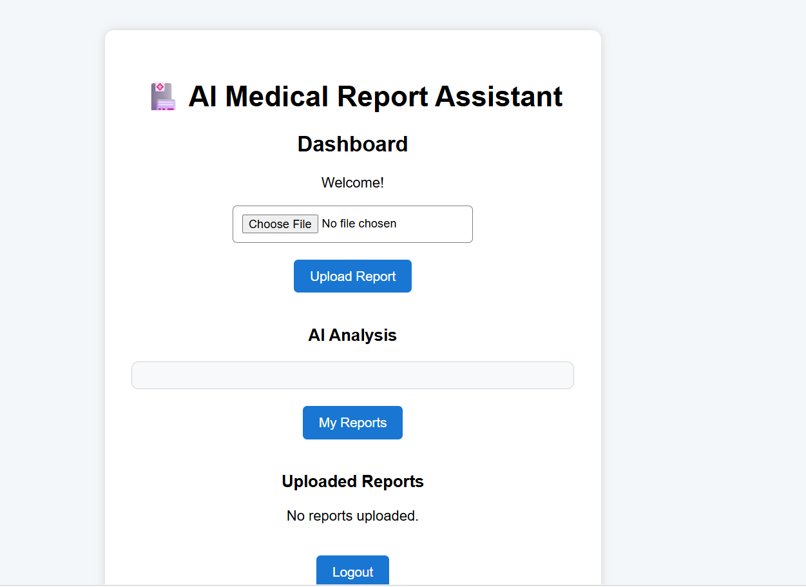
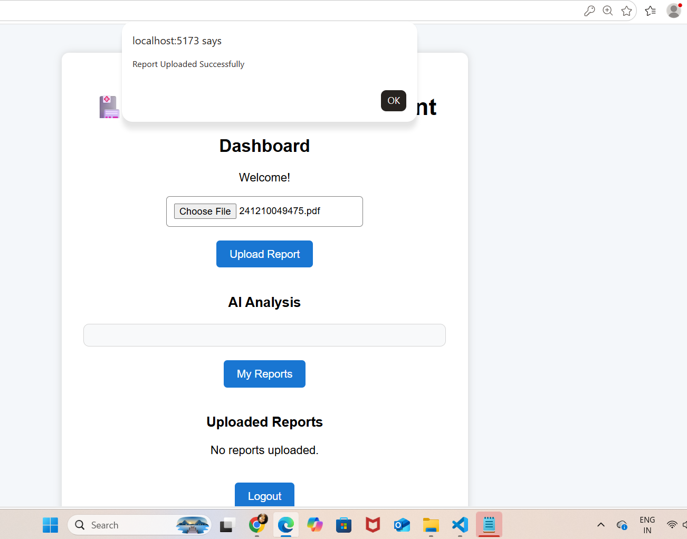
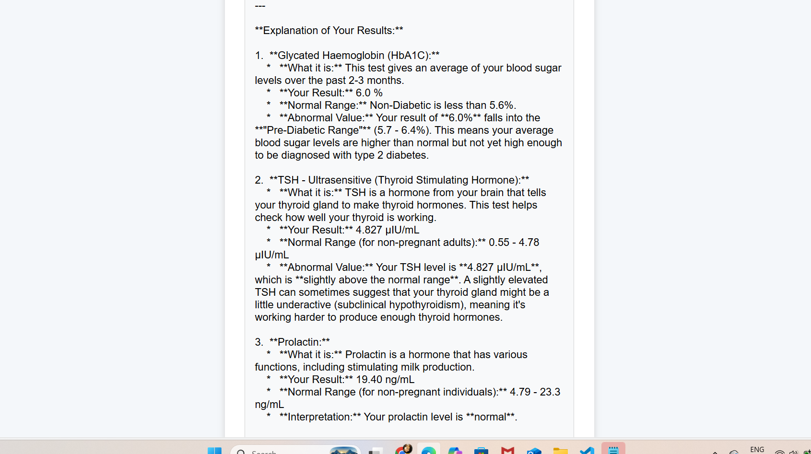

# 🏥 AI Medical Report Assistant using FastAPI, React & Gemini AI

An AI-powered web application that enables users to securely upload medical reports in PDF format and receive AI-generated explanations using Google's Gemini AI.

The application implements user authentication with JWT, PDF text extraction, AI-powered report analysis, secure report management, and a responsive React frontend integrated with a FastAPI backend.
---

# 🚀 Features

- 🔐 User Registration & Login
- 🔑 JWT Authentication
- 📄 Upload Medical Reports (PDF)
- 📑 Extract Text from PDF
- 🤖 AI-powered Medical Report Analysis using Gemini AI
- 📋 View Uploaded Reports
- 🗑 Delete Reports
- 📊 Dashboard for User Reports
- 💾 SQLite Database Integration
- 🌐 RESTful API using FastAPI

---

# 🛠 Tech Stack

## Backend

- Python
- FastAPI
- SQLAlchemy
- SQLite
- JWT Authentication
- Passlib (bcrypt)
- PyMuPDF
- Google Gemini AI
- Uvicorn

## medical-report-frontend

- React.js
- Axios
- HTML
- CSS
- JavaScript

---

# 📂 Project Structure

```
medical-report-assistant
│
├── app
│   ├── ai_analyzer.py
│   ├── database.py
│   ├── dependencies.py
│   ├── jwt_handler.py
│   ├── main.py
│   ├── models.py
│   ├── pdf_reader.py
│   ├── schemas.py
│   └── security.py
│
├── uploads
├── frontend
├── requirements.txt
└── README.md
```

---

# ⚙️ Workflow

```
User
   │
   ▼
Register / Login
   │
   ▼
JWT Authentication
   │
   ▼
Upload Medical Report
   │
   ▼
Extract PDF Text
   │
   ▼
Gemini AI Analysis
   │
   ▼
Store Analysis in Database
   │
   ▼
Display Report History
```

---

# 🔗 API Endpoints

| Method | Endpoint | Description |
|---------|----------|-------------|
| Method | Endpoint | Description |
|---------|----------|-------------|
| POST | /register | Register User |
| POST | /login | Login User |
| POST | /upload-report | Upload Medical Report |
| GET | /my-reports | View Uploaded Reports |
| DELETE | /report/{id} | Delete Report |
---

# 🧠 AI Capabilities

Google Gemini AI is used to:

- Explain medical terminology in simple English
- Highlight abnormal values
- Generate concise summaries
- Improve readability of medical reports
- Encourage users to consult healthcare professionals

---

# 🔒 Security

- JWT Authentication
- Password Hashing using bcrypt
- Protected Endpoints
- User-specific Report Access

---

# 📚 Key Learnings

This project helped me gain practical experience in:

- FastAPI REST API Development
- SQLAlchemy ORM
- JWT Authentication
- Password Hashing
- PDF Processing
- Google Gemini AI Integration
- Backend Architecture
- Database Design
- React + FastAPI Integration

---

# 🚀 Future Enhancements

- Chat with Uploaded Reports (RAG)
- Medical Report Comparison
- ChromaDB / Qdrant Integration
- AI Chat Assistant
- Multi-language Support
-Chat with Medical Reports (RAG)
-Vector Database (Qdrant/ChromaDB)
-cloud deployment

---

# 📸 Screenshots

# 📸 Screenshots

## Login Page


---

## Registration Page


---

## Dashboard



---

## Upload Report



---

## AI Analysis



---

# 👩‍💻 Author

**Kavya Pabboju**

- Aspiring Data scientist
- Ex-Accenture
- Executive PG Certification in Data Science & AI (IIT Roorkee)
